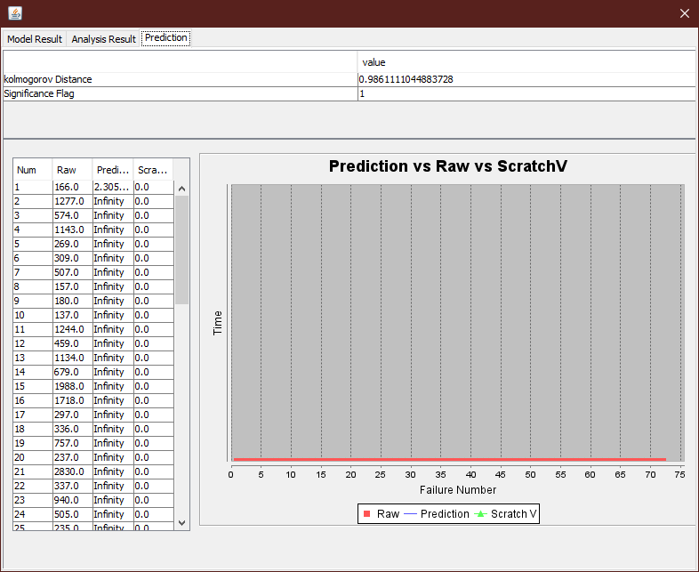
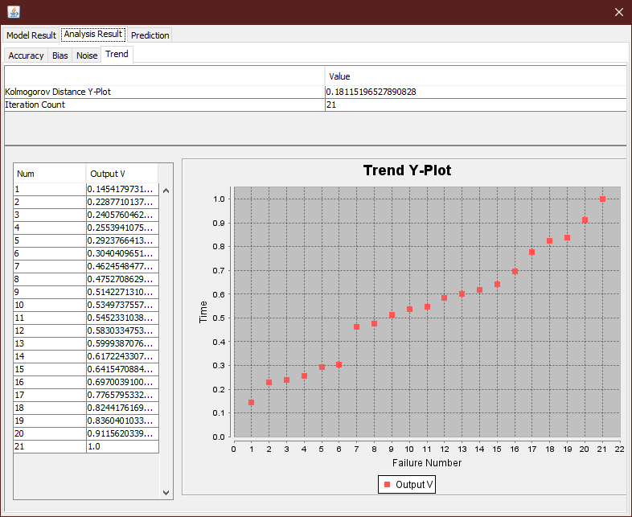

**SENG 438- Software Testing, Reliability, and Quality**

**Lab. Report \#5 – Software Reliability Assessment**

| Group 14:           |
| ------------------- |
| Student 1: Nicholas |
| Student 2: Shahdad  |
| Student 3: Hamza    |
| Student 4: Jaron    |

# Introduction

This lab includes analysis of integration test data using reliability assessment tools. There are two ways to assess failure data:

1. Reliability growth testing
2. Reliability assessment using Reliability Demonstration Chart (RDC)

For both of above parts of this lab, we have utilized SRTAT to generate required outputs of this assignment.

## Model Ranking

Before testing, we performed a model comparison. This is using data from "Failure Report 10.docx". (*We only gotC-SFRAT running after SRTAT, so we used the 'Geometric' and 'Littlewood and Varral's Bayesian Reliability' models as per the instructions, instead of the ones we ranked below.*)

This graph provides a visual as to how each model interprets the failure intensity of system. It can be seen that IFRGSB and GM favours utilizing the average of the failure intensity compared to DW3 and S, as both IFRGSB and GM start higher due to the spike in failure intensity in time intervals 2 and 3.

This graph provides inside into what each model predicts the number of failures will be in the time intervals extending past the provided data. These models were the top 4, as such, they have similar results. The decreasing slope of the line indicates that the system is predicted to have fewer failures as time proceeds.

C-SFRAT provides a statistical method to compare each model. It calculates multiple goodness of fit measures and utilizes a critic method to rank models based on a weighted combination of multiple measures. The 4 models shown were relatively close, so the difference between the critic calculations are a bit exaggerated compared to the differences in each measure.

## Laplace Trend Test

To determine what range of time is appropriate to test, we performed a laplace trend test on "Failure Report 10.docx". Using the equation from the lectures, we were able to generate the table shown above (time intervals of 2000 s). This tells us that the system was stable (between -2 to 2) for the most part, except for the initial time interval. As such, we selected the range from 14-28, as we felt it was suitable to demonstrate the operation of the system.

# Assessment Using Reliability Growth Testing

As mentioned in the introduction portion of this assignment, we have utilized SRTAT to generate required outputs. For this portion, we chose to use provided "Failure Report 10.docx" file and after converting its data to a text file and by importing to SRTAT and using Littlewood and Varral's Bayesian Reliability model plus Trend Analysis, Below outputs are generated:

## Prediction:

### Trend for above input file with 15 iterations is (failure numbers 14~28):

Using Geometric model plus Trend Analysis, the outputs below are generated:

## Prediction:

### Trend for above input file with 15 iterations is (failure numbers 14~28):

# Assessment Using Reliability Demonstration Chart

As mentioned in the introduction portion of this assignment, we have utilized SRTAT to generate required outputs. Like with the reliability growth testing, we used "Failure Report 10.docx". Once our converted data was uploaded, we generated our RDCs which can be seen below. It's important to note that for all 3 charts, Discrimination ratio, Customer risk and Developer risks are kept constant and only number of failures per second is modified:

### Result with minimum acceptable MTTFmin (3.85 failures per 1000 seconds):

### Result with doubling of number of failures per second (7.7 failures per 1000 seconds):

### Result with halving of number of failures per second (1.925 failures per 1000 seconds):

MTTFmin was determined through a process of trial and error. Different values for the "failures per second" field were selected until the SUT fell just beyond the acceptance margin into the acceptable region. This yielded the result of 3.85 failures per 1000 seconds as the MTTFmin. Then is was simply a matter of multiplying and dividing MTTFmin by 2 to get the other two charts.

# Comparison of Results

From results generated by using Reliability Demonstration Chart, it can be observed that the SUT can be well accepted with 7.7 failures per 1000 seconds. The system can just barely be accepted with 3.85 failures per 1000 seconds, but it will not be accepted with 1.925 failures per 1000 seconds and further testing must be performed to decide if the SUT will be accepted or rejected.

# Discussion on the Advantages and Disadvantages of the Two Techniques

| Reliability Growth Testing                                                                                                                                                                                          |
| :------------------------------------------------------------------------------------------------------------------------------------------------------------------------------------------------------------------ |
| Pros   - Can be performed during many stages of development   - Based on inter failure times, failure count and MTTF   - Utilizes different models                                              |
| Cons   -                                                                                                                                                                                                     |
| **Reliability Demonstration Chart**                                                                                                                                                                           |
| Pros   - Can be used with a limited dataset   - Can test with different values of confidence levels and MTTF   - Is time and cost efficient                                                       |
| Cons   - Does not provide a quantitative value for reliability, it only indicates whether the SUT is acceptable or not   - Typically more effective in evaluating the reliability of a finished product |

## Discussion on Similarity and Differences of the Two Techniques

Both techniques provide information on the reliability of the system in testing using data on product failure. This information is used to improve the system's reliability and to ensure that it is compliant with any reliability requirements.

Although both techniques help provide information on the reliability of the system, there are several differences

- RDC is more commonly used for evaluating a finished product while RGT is used during the development process as a more proactive approach
- RDC is only based on inter failure times and MTTF while RGT is based on inter failure times, failure count and MTTF
- RDC is not as capable of evaluating multiple tests/failures while RGT is able to evaluate multiple failure types

## Failure Intensity Graph

The failure intensity graph provides insight regarding the distribution of failures across a period of time. In this case, each time interval (x-axis) is an interval of 2000s. The information for "Failure Report 10.docx" was provided in a format of *time since last failure*, as such, the data had to be converted into *# of failures in a time interval.* This process was done manually and recorded in a spreadsheet.

The failure intensity graph is a useful graphic for finding a more generalized description of the systems performace. For example, it can be seen in the graph above that the system had a decreased amount of failures as time progressed, having an average around 2.5 failures per time interval from time intervals 0-22, then averaging around 1.5 afterwards.

# How the team work/effort was divided and managed

# Difficulties encountered, challenges overcome, and lessons learned

# Comments/feedback on the lab itself
